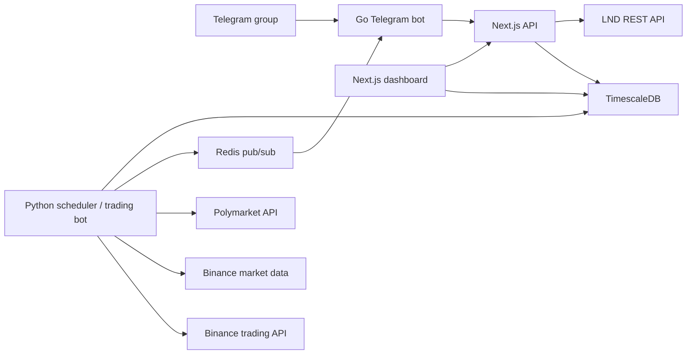

# Cassandrina

Cassandrina is a gamified Bitcoin prediction and trading system.

It lets a community submit daily BTC price predictions, pay for those predictions over the Lightning Network, convert the paid predictions into a consensus target price, score participants over time, choose a risk strategy from that consensus, and optionally place a live Binance trade based on the group's conviction.

The repository currently contains:

- a Next.js dashboard and API
- a Python trading bot and scheduler
- a Go Telegram bot
- TimescaleDB and Redis infrastructure

## What Cassandrina Does

At a high level, Cassandrina runs a daily prediction round:

1. A prediction window opens.
2. Users submit a BTC target price and a sats amount.
3. The system generates a Lightning invoice for each prediction.
4. Only paid predictions count toward the round.
5. Paid predictions are combined into a weighted target price.
6. The bot computes a confidence score from user history plus Polymarket context.
7. A strategy from `A` to `E` is selected.
8. The bot optionally places a Binance trade.
9. At settlement time, the round is scored and profit/loss is distributed proportionally.

In other words: Cassandrina turns social forecasting into a pooled, rules-driven trading signal.

## Why It Exists

Cassandrina is built around a simple idea:

- predictions are more meaningful when they cost something
- conviction should matter, not just opinion
- a group signal becomes more useful when it is measured over time
- risk should adapt to confidence instead of staying static

The system therefore rewards two things:

- being right
- backing your prediction with meaningful size

That second concept is called congruency.

## The Core Concept: Congruency

In Cassandrina, congruency means alignment between what a user says and how much they are willing to commit.

If someone predicts confidently but only pays the minimum amount, the system treats that as low congruency. If someone backs their prediction with a larger share of the allowed allocation, the system treats that as higher congruency.

Congruency is not about whether the prediction was correct. It is about how strongly the user stood behind it.

### Congruency Formula

For each round:

```text
round_congruency = min((sats_invested / max_sats) * 100, 100)
```

With the default configuration:

- `min_sats = 100`
- `max_sats = 5000`

That means:

- `100 sats` -> `2.0%` congruency for that round
- `2500 sats` -> `50.0%`
- `5000 sats` -> `100.0%`

The user's long-term congruency score is then updated using a weighted moving average:

```text
new_congruency = 0.7 * old_congruency + 0.3 * round_congruency
```

This makes congruency:

- slow enough to avoid wild swings
- responsive enough to reflect recent behavior
- useful as a signal of conviction over time

## How the System Works

### 1. Prediction window opens

The Python scheduler opens a daily round and publishes an event on Redis.

By default the round settings are:

- prediction opens at `08:00 UTC`
- prediction window lasts `6 hours`
- settlement target time is `16:00 UTC`

These values are configurable through the dashboard and stored in `bot_config`.

### 2. Users submit predictions

In Telegram, users reply in this format:

```text
<price> <sats>
```

Example:

```text
95000 500
```

The Telegram bot parses the message and sends it to the web API.

### 3. Lightning invoice is created

The web API:

- validates the payload
- finds or creates the user
- checks that there is an open round
- prevents duplicate predictions in the same round
- creates a Lightning invoice through LND
- stores both the prediction and invoice metadata

Only paid invoices turn into active predictions.

### 4. Paid predictions become the round consensus

When the window closes, Cassandrina looks only at paid predictions.

The round target price is a sats-weighted average:

```text
target_price = sum(predicted_price * sats_amount) / sum(sats_amount)
```

This means larger paid predictions influence the final target more than smaller ones.

### 5. Confidence is computed

Cassandrina combines three inputs:

- average participant accuracy
- average participant congruency for the current round
- Polymarket BTC probability

Formula:

```text
confidence = (avg_accuracy + avg_congruency + polymarket_score) / 3
```

Where:

- `avg_accuracy` is on a `0-100` scale
- `avg_congruency` is on a `0-100` scale
- `polymarket_score = polymarket_probability * 100`

### 6. A trading strategy is selected

The confidence score maps to one of five strategies:

| Strategy | Confidence | Current behavior in code |
| --- | --- | --- |
| `A` | `>= 65` | BTCUSDT futures, fixed leverage `30x` |
| `B` | `55-64.99` | BTCUSDT futures, fixed leverage `20x` |
| `C` | `45-54.99` | neutral grid using 5 limit orders |
| `D` | `35-44.99` | spot mode with `10%` take profit |
| `E` | `< 35` | spot mode with `2%` take profit |

Direction is inferred from the relationship between the live BTC price and the round target:

- if `target_price >= current_price`, direction is `long`
- otherwise, direction is `short`

### 7. The trade is executed or dry-run simulated

If live trading is enabled and Binance credentials are present, the bot executes the selected strategy on Binance.

If not, the system still creates the round analysis and trade record, but marks it as a dry run in the Telegram event flow.

### 8. The round settles

At settlement time:

- the actual BTC price is fetched
- each paid prediction is checked for correctness
- user accuracy is updated
- user congruency is updated
- the open trade is closed and PnL is computed
- profit or loss is distributed back to users proportionally to their sats contribution

## Accuracy Rules

A prediction is considered correct if the actual BTC price is within `+-2%` of the predicted price.

Accuracy also uses a weighted moving average:

```text
round_accuracy = 100 if correct else 0
new_accuracy = 0.7 * old_accuracy + 0.3 * round_accuracy
```

All users start with:

- `accuracy = 50.0`
- `congruency = 50.0`

That gives new users a neutral starting point instead of an artificial advantage or penalty.

## User Rules

These are the practical rules enforced by the current codebase.

### Participation rules

- Users submit predictions in Telegram group chat using `<price> <sats>`.
- Each user can submit only one prediction per round.
- A prediction only counts after its Lightning invoice is paid.
- If there is no open round, the API rejects the prediction.
- Telegram predictions must respect the configured minimum and maximum sats limits.
- The API currently rate limits prediction attempts to `3` attempts per user identity per `10 minutes`.
- The scheduler currently treats `1` paid prediction as enough to close a round early once the periodic close check runs.

### Payment rules

- The prediction invoice is created with a `1 hour` expiry.
- Unpaid predictions are ignored during round consensus and settlement.
- A paid prediction increases the internal user ledger by the invoice amount.

### Default sats rules

By default:

- minimum prediction size is `100 sats`
- maximum prediction size is `5000 sats`

Important implementation note:

- the shared API schema also hard-caps `sats_amount` at `100,000 sats`
- the operator-facing `min_sats` and `max_sats` config is the intended user rule
- the Telegram bot enforces the configured min/max before calling the API

## How User Money Is Invested

This is the most important section for users and operators.

### What happens to paid sats

When a user pays a Lightning invoice:

- the payment is recorded against that prediction
- the prediction becomes eligible for the round
- the sats amount contributes to the round's weighted target price
- the sats amount is added to the system's internal balance ledger

When the round closes, the bot sums all paid sats:

```text
sats_deployed = sum(all paid sats for the round)
```

That total determines the notional size of the round's trade.

### How the trade size is derived

The trade executor converts sats into BTC quantity:

```text
btc_quantity = sats_deployed / 100,000,000
```

Then it rounds to Binance lot constraints, with a minimum of `0.001 BTC` in the current implementation.

Important sizing caveat:

- `0.001 BTC` is about `100,000 sats`
- that is much larger than the default per-user range of `100-5000 sats`
- for small rounds, the current exchange sizing floor can exceed the internal sats pool that the ledger says is deployed

So while the ledger and PnL model are sats-based, the live execution sizing path still needs tightening before it should be trusted with production capital.

### How profit and loss is distributed

After settlement, round PnL is split proportionally by each user's sats contribution:

```text
user_share = total_round_pnl * user_sats / total_round_sats
```

So if:

- Alice contributes `1000 sats`
- Bob contributes `4000 sats`
- total deployed is `5000 sats`
- round PnL is `+1500 sats`

Then:

- Alice receives `+300 sats`
- Bob receives `+1200 sats`

The same rule applies to losses.

### Important operator caveat

Cassandrina tracks balances and round PnL in an internal sats ledger, but this repository does not include a full treasury reconciliation layer that automatically moves funds from LND into Binance.

That means, in live mode, the operator must ensure that:

- there is enough real capital on Binance
- the capital on Binance matches the pool the bot believes it is deploying
- accounting between Lightning-held funds and exchange-held funds is handled operationally

Put simply:

- the software models the pool in sats
- the bot can place real exchange orders
- treasury synchronization between the two is still an operator responsibility

## Example Round

Suppose the following paid predictions exist:

| User | Prediction | Sats |
| --- | --- | --- |
| Alice | `$100,000` | `1000` |
| Bob | `$92,000` | `4000` |

The weighted target becomes:

```text
((100000 * 1000) + (92000 * 4000)) / 5000 = 93,600
```

If live BTC is currently `$93,000`, the direction becomes `long`.

If the combined confidence score is `58`, Cassandrina selects `Strategy B`.

If the round later closes with `+1000 sats` PnL:

- Alice gets `+200 sats`
- Bob gets `+800 sats`

This example captures the main philosophy of the system:

- the crowd sets the direction and target
- capital size affects influence
- outcome sharing follows contribution size

## Architecture



## Repository Layout

```text
apps/
  telegram-bot/    Go bot that listens to Telegram and Redis events
  webapp/          Next.js dashboard and API routes
services/
  trading-bot/     Python scheduler, scoring engine, strategy selector, execution layer
packages/
  shared/          Shared TypeScript types and validation schemas
infrastructure/
  configs/         DB and Redis configuration
  docker-compose*.yml
```

## Main Components

### Web app (`apps/webapp`)

The web app provides:

- dashboard and analytics
- predictions history
- wallet and ledger visibility
- user leaderboard
- bot configuration page
- API endpoints used by Telegram and internal services

### Trading bot (`services/trading-bot`)

The Python service is the decision engine. It handles:

- scheduling rounds
- checking LND invoice settlement
- calculating target price
- computing confidence
- selecting strategy
- opening and closing trades
- updating user scores
- distributing profit and loss

### Telegram bot (`apps/telegram-bot`)

The Telegram bot handles:

- group collection of predictions
- DM delivery of Lightning invoices
- round open and close announcements
- trade open and close announcements
- periodic stats updates
- weekly vote prompts

## Data Model

The core tables are:

- `users`
- `prediction_rounds`
- `predictions`
- `lightning_invoices`
- `trades`
- `balance_entries`
- `bot_config`

TimescaleDB hypertables are used for:

- `predictions`
- `trades`
- `balance_entries`

That makes the project better suited for time-series analytics and historical reporting.

## Running the Project

### Prerequisites

- Docker and Docker Compose
- Node.js and `pnpm` if you want to run the web app outside Docker
- Python 3.11 if you want to run the trading bot outside Docker
- access to an LND node if you want real Lightning invoices
- Binance API credentials if you want live execution
- a Telegram bot token and target group chat ID if you want chat-based participation

### Environment setup

Copy the example environment file:

```bash
cp .env.example .env
```

Then fill in at least:

- Postgres credentials
- LND host and macaroon
- Binance credentials
- Telegram bot token
- Telegram group chat ID

### Production-style Docker run

```bash
docker compose -f infrastructure/docker-compose.yml up --build -d
```

This starts:

- TimescaleDB
- Redis
- Next.js web app
- Python trading bot
- Go Telegram bot

### Raspberry Pi reboot startup

If you want the stack to come back automatically after a Pi reboot:

1. Enable the local daemons you depend on:

```bash
sudo systemctl enable --now docker
sudo systemctl enable --now bitcoind
sudo systemctl enable --now lnd
```

2. Install the Cassandrina `systemd` unit from the repo root:

```bash
sudo ./infrastructure/systemd/install-cassandrina-service.sh
```

3. Reboot and verify:

```bash
systemctl status cassandrina --no-pager
docker compose -f infrastructure/docker-compose.yml ps
```

The installer script creates `/etc/systemd/system/cassandrina.service`,
enables it on boot, and makes it wait for local `bitcoind` and `lnd` services
when those unit names exist on the Pi. More detailed notes live in
`infrastructure/systemd/README.md`.

### Development Docker run

```bash
docker compose -f infrastructure/docker-compose.dev.yml up --build
```

The development compose file currently focuses on:

- TimescaleDB
- Redis
- web app development server
- Python test execution

It does not currently start the Telegram bot service.

### Monorepo commands

From the repository root:

```bash
pnpm dev
pnpm build
pnpm test
pnpm lint
```

## Configuration

Runtime configuration lives in the `bot_config` table and is editable from the dashboard.

Important keys include:

- `prediction_open_hour`
- `prediction_target_hour`
- `prediction_window_hours`
- `min_sats`
- `max_sats`
- `weekly_vote_day`
- `weekly_vote_hour`
- `trading_enabled`

## Current Behavior vs. Important Caveats

These are worth understanding before calling the project production-ready.

### Live trading can be disabled

If `trading_enabled` is false, or if Binance credentials are missing, Cassandrina still computes strategy and stores a trade record, but the result is effectively a dry run.

### Weekly vote is currently informational

The scheduler publishes a weekly vote event to Telegram, but the codebase does not currently persist vote results or feed them back into strategy selection.

### Strategy descriptions are simpler than a full portfolio engine

The system chooses one round-level strategy from `A` to `E`. It is not currently a multi-asset portfolio allocator or per-user custom execution engine.

### Treasury sync is not automated

The ledger logic and the exchange execution logic both exist, but movement of capital between Lightning custody and Binance custody is not automated in this repo.

### Early round closure is permissive right now

The scheduler is currently configured with `min_paid_predictions = 1`, so a round can close as soon as the first paid prediction is verified. If you want a real crowd-consensus system, you will probably want to raise this threshold or make it configurable.

### Spot short behavior should be reviewed before real-money use

Strategies `D` and `E` are described as lower-risk spot strategies. In the current implementation, spot execution starts with a spot buy flow and then adds take-profit behavior based on direction. If you intend to run live capital, review this path carefully and harden it before production deployment.

### Binance minimum order sizing needs production hardening

The current `_sats_to_btc` conversion enforces a minimum order size of `0.001 BTC`. That is practical for Binance constraints, but it can materially exceed the round's actual sats pool. Before trading live, align exchange sizing with the treasury model and the real amount of capital available.

### Polymarket market selection is intentionally simple

The current Polymarket client fetches active BTC markets and uses the first relevant match's `Yes` price as probability input. This is a reasonable starting point, but not a full market-selection engine.

## Security and Operations Notes

- Never commit a real `.env` file.
- Keep Lightning macaroons scoped as narrowly as possible.
- Run Binance in testnet mode until the strategy logic is validated end to end.
- Protect the dashboard config route with a strong admin PIN and stronger auth before public deployment.
- Add monitoring around invoice settlement, round closure, and trade execution failures.
- Treat this project as experimental trading infrastructure unless you add stronger reconciliation, auth, and operational controls.

## Testing

The repository includes tests for:

- scoring
- strategy selection
- trade execution
- scheduler behavior
- Binance and Polymarket clients
- web API routes
- selected UI components

## Suggested Next Improvements

If you want to turn Cassandrina into a safer production system, the highest-value next steps are:

1. Add treasury reconciliation between LND and Binance balances.
2. Persist and apply weekly vote outcomes.
3. Add stronger authentication and authorization to the operator dashboard.
4. Add idempotency and duplicate-protection at the database level where possible.
5. Improve Polymarket market matching so the probability input is more precise.
6. Harden live execution rules, especially for spot strategies and exchange-side risk controls.
7. Add alerts, audit logs, and failure recovery around invoice verification and order management.

## Disclaimer

Cassandrina is software for prediction-based, automated trading experiments. It is not financial advice, not custody software, and not a complete treasury management system in its current form.

If you use it with real money, you are responsible for:

- exchange risk
- Lightning custody risk
- regulatory compliance
- operational security
- treasury reconciliation
